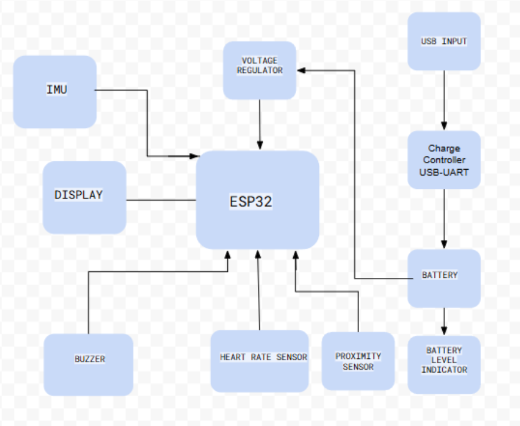
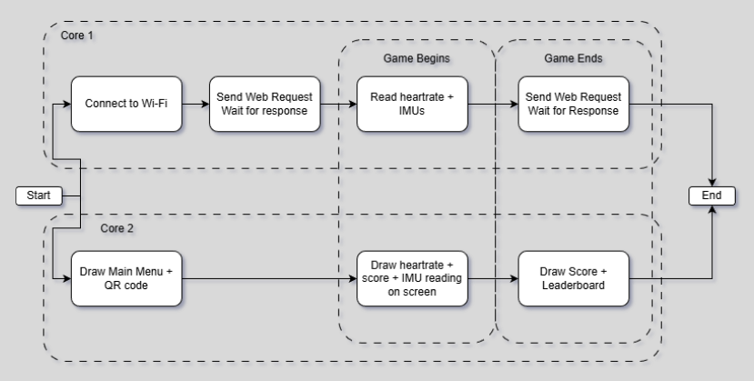
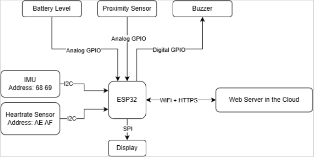
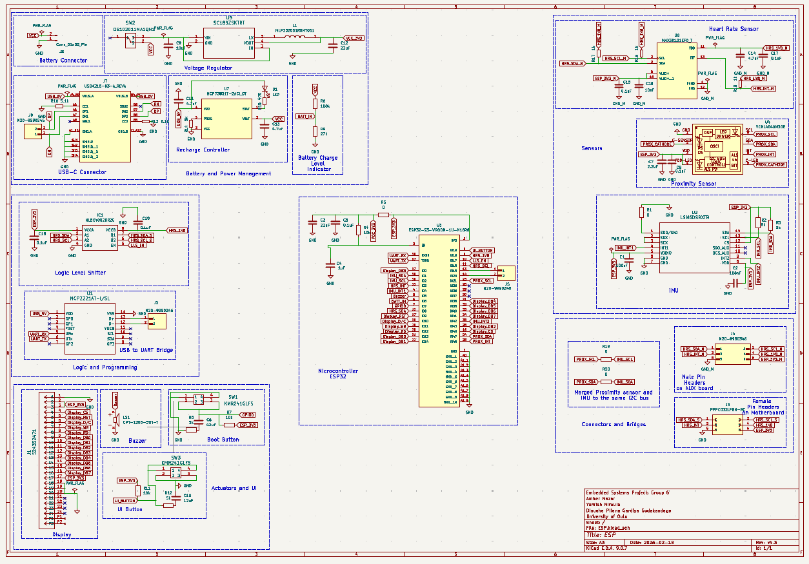
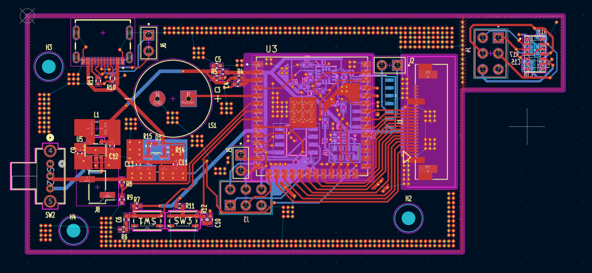
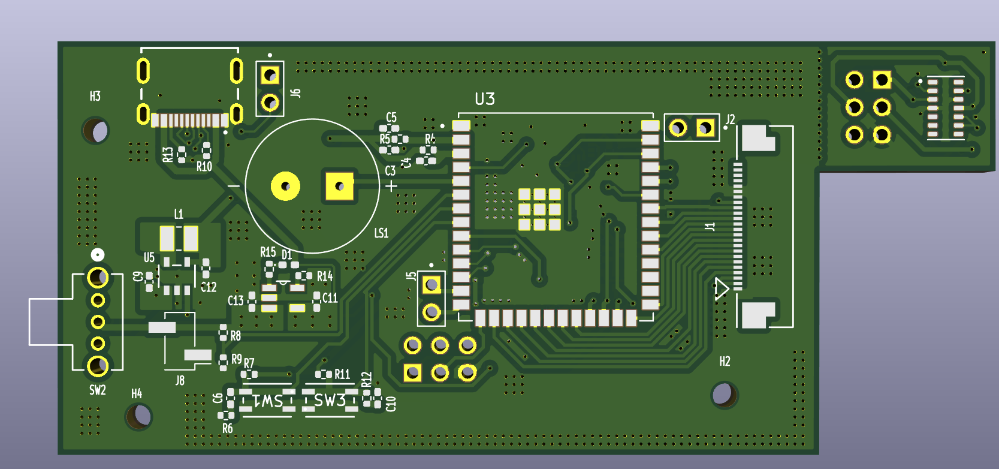

# PulseRace – Competitive heart-rate monitoring

_Can you get a higher heart rate than the other guy?_

# Technical Details

We developed a shared wearable that calculates a competitive score based on heart rate and motion intensity. The technical solution utilizes an ESP32-S3, MAX30102 HR sensor, and BMI323 IMU, featuring an automated web-based registration system and cloud-synced leaderboard.

## System Overview

## Software Architecture

## Communication Diagram

## Schematic

## PCB Layout

## PCB 3D View

# Demo for Springineering Challenge

For the demo we are recreating the experience with a mobile phone, the demo code can be found under software/.

Demo Video: https://www.youtube.com/watch?v=nNgHs_067A8
